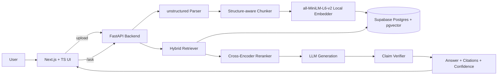

# RAG with Grounded Citations

> Production-grade document Q&A: every answer cites exact source spans, every claim carries a confidence score, and the system says "I don't know" when retrieval is weak.

**Status**: 🚧 In progress — Days 1–2 complete (ingestion + vector search), Days 3–10 in progress.

---

## What makes this different from generic RAG

Most RAG demos retrieve chunks and dump them into an LLM prompt. This project goes further:

- **Inline citations** — every claim in the answer links back to the exact source span in the original document, not just the document name
- **Confidence scoring** — each claim is scored independently; low-confidence claims are flagged in the UI
- **Abstention** — when retrieval similarity is uniformly weak, the system says "I don't have enough information" instead of hallucinating
- **Hybrid retrieval** — vector search + BM25 keyword search fused via Reciprocal Rank Fusion, then reranked with a cross-encoder

---

## Architecture



---

## Tech Stack

| Layer | Choice | Why |
|---|---|---|
| Frontend | Next.js 14 + TypeScript + Tailwind + shadcn/ui | Modern, type-safe |
| Backend | Python 3.12 + FastAPI + Pydantic | Best AI/ML ecosystem |
| Vector DB | pgvector on Supabase (free) | No Pinecone cost |
| Embeddings | `all-MiniLM-L6-v2` via sentence-transformers | Free, runs on CPU |
| LLM | Groq Llama 3.3 70B (dev) + Claude Sonnet (final demo) | Free dev path |
| Doc parsing | `unstructured` | Production-grade PDF/MD parsing |
| Hosting | Vercel (frontend) + Render (backend) | Free tier |

---

## Project Structure

```
/rag-grounded
├── /api                          # Python 3.12 + FastAPI backend
│   └── /app
│       ├── main.py               # FastAPI app + route wiring
│       ├── /routes
│       │   ├── documents.py      # Upload, list, status endpoints
│       │   └── search.py         # Vector search endpoint
│       ├── /ingestion
│       │   ├── chunker.py        # Structure-aware chunker with char offsets
│       │   └── embedder.py       # Local sentence-transformers embedder
│       ├── /retrieval
│       │   └── vector.py         # pgvector cosine similarity search
│       ├── /generation           # (Day 4) LLM + citation injection
│       ├── /verification         # (Day 5) Claim scoring + abstention
│       └── /db
│           └── client.py         # Supabase client
└── /web                          # Next.js 14 frontend (Day 6)
```

---

## API Endpoints

```
POST   /v1/documents               Upload PDF/MD/TXT → {document_id, status}
GET    /v1/documents               List all documents
GET    /v1/documents/{id}/status   Poll ingestion status
GET    /v1/search?q=...&top_k=5    Semantic search across chunks
GET    /healthz                    Liveness check
```

---

## Key Design Decisions

### Structure-aware chunking over fixed-window chunking

Most tutorials chunk at every N tokens blindly. This project splits by markdown headings first, then by paragraph within each section. Every chunk stores `start_char` and `end_char` offsets into the original document — these are what power citation highlighting later. Blind fixed-window chunking breaks across section boundaries and makes citations meaningless.

### Local embeddings over OpenAI API

Using `all-MiniLM-L6-v2` via `sentence-transformers` instead of `text-embedding-3-small`. Reasons: zero API cost during development, no network latency, 384-dim vectors are fast to index and query. Trade-off: slightly lower retrieval quality than `text-embedding-3-small` on complex technical documents. Will benchmark both in the eval harness (Day 8).

### pgvector + SECURITY DEFINER function

Supabase's Row Level Security blocks functions from seeing rows unless the function runs with elevated permissions. The `match_chunks` Postgres function uses `SECURITY DEFINER` so it runs as its owner (postgres) and bypasses RLS. The Python client sends embeddings as text strings (`"[0.1,0.2,...]"`) rather than arrays because the Supabase client can't auto-cast Python lists to the `vector` type.

### Hybrid retrieval (coming Day 3)

Vector search alone misses exact keyword matches. BM25 via Postgres `tsvector` catches these for free with no extra infrastructure. Results from both are fused via Reciprocal Rank Fusion (RRF), then a cross-encoder reranker (`cross-encoder/ms-marco-MiniLM-L-6-v2`) scores the top candidates. This combination improves citation precision significantly over vector-only retrieval.

---

## Setup

### Prerequisites

- Node.js 22+
- Python 3.12+
- `uv` (Python package manager)
- A free [Supabase](https://supabase.com) account

### Database setup

In Supabase SQL Editor:

```sql
CREATE EXTENSION IF NOT EXISTS vector;

CREATE TABLE documents (
  id            UUID PRIMARY KEY DEFAULT gen_random_uuid(),
  title         TEXT NOT NULL,
  source_type   TEXT NOT NULL,
  status        TEXT DEFAULT 'pending',
  error_message TEXT,
  created_at    TIMESTAMPTZ DEFAULT now()
);

CREATE TABLE chunks (
  id            UUID PRIMARY KEY DEFAULT gen_random_uuid(),
  document_id   UUID REFERENCES documents(id) ON DELETE CASCADE,
  chunk_index   INTEGER NOT NULL,
  content       TEXT NOT NULL,
  start_char    INTEGER NOT NULL,
  end_char      INTEGER NOT NULL,
  section_title TEXT,
  embedding     vector(384),
  ts_vector     tsvector GENERATED ALWAYS AS (to_tsvector('english', content)) STORED
);

CREATE INDEX chunks_embedding_idx ON chunks USING ivfflat (embedding vector_cosine_ops) WITH (lists = 100);
CREATE INDEX chunks_ts_idx ON chunks USING gin(ts_vector);
```

Then create the vector search function:

```sql
CREATE FUNCTION match_chunks(
  query_embedding    text,
  match_count        int,
  filter_document_id uuid DEFAULT NULL
)
RETURNS TABLE (
  id uuid, document_id uuid, content text,
  section_title text, start_char int, end_char int, similarity float
)
LANGUAGE sql STABLE SECURITY DEFINER SET search_path = public
AS $$
  SELECT c.id, c.document_id, c.content, c.section_title, c.start_char, c.end_char,
         1 - (c.embedding <=> query_embedding::vector(384)) AS similarity
  FROM chunks c
  WHERE c.embedding IS NOT NULL
    AND (filter_document_id IS NULL OR c.document_id = filter_document_id)
  ORDER BY c.embedding <=> query_embedding::vector(384) ASC
  LIMIT match_count;
$$;
```

### Backend

```bash
cd api
cp .env.example .env   # fill in your Supabase URL + service key
uv install
uv run uvicorn app.main:app --reload --port 8000
```

### Frontend

```bash
cd web
pnpm install
pnpm dev
```

---

## Eval Results

*(Day 8 — to be filled in)*

| Metric | Vector-only | Hybrid | Hybrid + Rerank |
|---|---|---|---|
| Recall@5 | — | — | — |
| Answer accuracy | — | — | — |
| Citation precision | — | — | — |

---

## Roadmap

- [x] Day 1 — Scaffolding, PDF/MD ingestion, document storage
- [x] Day 2 — Structure-aware chunking, local embeddings, vector search
- [ ] Day 3 — BM25 keyword search + hybrid RRF fusion + cross-encoder reranking
- [ ] Day 4 — LLM answer generation with inline citation injection
- [ ] Day 5 — Claim verification, confidence scoring, abstention
- [ ] Day 6 — Frontend: chat UI, citation highlighting, file uploader
- [ ] Day 7 — Auth (Supabase), multi-tenancy, deployment
- [ ] Day 8 — Evaluation harness (20 Q&A ground truth set)
- [ ] Day 9 — OpenTelemetry tracing, Prometheus metrics, Grafana dashboard
- [ ] Day 10 — README polish, DESIGN.md, demo video

---

## Cost

| Component | Service | Cost |
|---|---|---|
| Embeddings | Local `all-MiniLM-L6-v2` | $0 |
| LLM (dev) | Groq Cloud | $0 |
| LLM (final demo) | Anthropic Claude Sonnet | ~$5 |
| Database | Supabase free tier | $0 |
| Hosting | Vercel + Render free tier | $0 |
| **Total** | | **~$5** |
