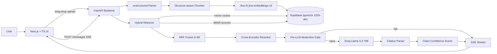

# RAG with Grounded Citations

> Production-grade document Q&A: every answer cites exact source spans, every claim carries a confidence score, and the system says "I don't know" when retrieval is weak.

[**Live demo**](https://rag-rounded.vercel.app) · [Architecture](#architecture) · [Eval results](#eval-results) · [Design decisions](DESIGN.md) · [API](#api-endpoints)

---

## What makes this different from generic RAG

Most RAG demos retrieve chunks and dump them into an LLM prompt. This project goes further:

- **Inline citations** — every claim links back to the exact source span in the original document, not just the document name
- **Confidence scoring** — each claim is scored independently via embedding cosine similarity; low-confidence claims are flagged in the UI
- **Two-layer abstention** — pre-LLM gate (cross-encoder rerank signal) + post-LLM gate (`INSUFFICIENT_INFO` sentinel); the system refuses to hallucinate rather than guessing
- **Hybrid retrieval** — vector search + BM25 fused via Reciprocal Rank Fusion, then reranked with a cross-encoder; beats vector-only on recall
- **SSE streaming** — answers stream word-by-word; citation metadata arrives in the same stream before the complete event
- **Full chat UI** — dark-mode interface with drag-drop upload, document list, streaming chat, clickable citation chips, and a slide-in source panel
- **Observability** — Prometheus metrics (`/metrics`), OpenTelemetry tracing, readiness probe (`/readyz`), pre-built Grafana dashboard

---

## Eval Results

Evaluated on a 20-question ground-truth set covering 6 distributed systems topics (consistency models, replication, consensus algorithms, distributed transactions, storage engines, observability). Each question has a verified ground-truth answer and an expected source section.

| Metric | Vector-only | Hybrid |
|---|---|---|
| Recall@5 | 1.000 | 1.000 |
| Answer accuracy (LLM-as-judge) | — | 0.925 |
| Citation precision | — | 1.000 |
| Abstention rate | — | 0.0% |

**Recall@5** — fraction of questions where the correct source section appeared in top-5 retrieved chunks.
**Answer accuracy** — Groq Llama 3.3 70B used as judge, scoring each generated answer 0 / 0.5 / 1 against ground truth.
**Citation precision** — fraction of cited chunks whose section matched the expected source section.

Eval document: [`distributed_systems_rag_eval.md`](distributed_systems_rag_eval.md) · Live results: `GET /v1/eval/results`

---

## Architecture



---

## Tech Stack

| Layer | Choice | Why |
|---|---|---|
| Frontend | Next.js 14 + TypeScript + Tailwind + shadcn/ui | Modern, type-safe, App Router |
| Backend | Python 3.13 + FastAPI + Pydantic | Best AI/ML ecosystem |
| Vector DB | pgvector on Supabase (free tier) | No Pinecone cost; pgvector is production-grade |
| Embeddings | Jina AI `jina-embeddings-v3` (1024-dim) | Zero RAM on server, 1M tokens free, asymmetric retrieval support |
| LLM (dev) | Groq Llama 3.3 70B | Free tier, ~2s latency |
| LLM (demo) | Anthropic Claude Sonnet | Swapped via `LLM_PROVIDER` env var |
| Doc parsing | `unstructured` | Production-grade PDF/MD/TXT parsing with structure preservation |
| Reranker | `cross-encoder/ms-marco-MiniLM-L-6-v2` | Free, runs on CPU, improves precision over bi-encoder |
| Streaming | Server-Sent Events (SSE) | Unidirectional, no WebSocket overhead, native browser support |
| Metrics | `prometheus-client` + `GET /metrics` | RED method per pipeline stage, Grafana-ready |
| Tracing | OpenTelemetry SDK (console / OTLP exporter) | Vendor-neutral, Jaeger/Grafana Cloud compatible |
| Hosting | Vercel (frontend) + Render (backend, Dockerized) | Both free tier |

---

## Project Structure

```
/rag-grounded
├── distributed_systems_rag_eval.md     # 6-section eval document (upload this for eval)
├── docker-compose.observability.yml    # Prometheus + Grafana local stack
├── prometheus/prometheus.yml           # Scrape config
├── grafana/dashboards/rag.json         # Pre-built Grafana dashboard
│
├── /api                                # Python 3.13 + FastAPI backend
│   ├── Dockerfile
│   ├── pyproject.toml
│   └── /app
│       ├── main.py                     # App entrypoint: CORS, /metrics, /healthz, /readyz
│       ├── /routes
│       │   ├── documents.py            # Upload + background ingestion (instrumented)
│       │   ├── search.py               # GET /v1/search ?mode=vector|hybrid|compare
│       │   ├── conversations.py        # Conversation CRUD
│       │   ├── messages.py             # Full pipeline → SSE stream (instrumented)
│       │   └── eval.py                 # GET /v1/eval/results
│       ├── /ingestion
│       │   ├── chunker.py              # Structure-aware chunker with char offsets
│       │   └── embedder.py             # Jina AI API (1024-dim, passage/query task types)
│       ├── /retrieval
│       │   ├── vector.py               # pgvector cosine similarity
│       │   ├── bm25.py                 # Postgres tsvector full-text search
│       │   ├── reranker.py             # Cross-encoder reranker
│       │   └── hybrid.py               # RRF fusion → rerank → top-5
│       ├── /generation
│       │   ├── llm.py                  # Groq + Anthropic client
│       │   ├── prompt.py               # [SOURCE_X] citation injection prompt
│       │   └── citation_parser.py      # Parse [SOURCE_X] → citation objects
│       ├── /verification
│       │   ├── abstention.py           # Pre-LLM gate: rerank score + Jaccard
│       │   └── confidence.py           # Per-claim cosine confidence scoring
│       ├── /telemetry
│       │   ├── otel.py                 # OpenTelemetry setup (console / OTLP)
│       │   └── metrics.py              # Prometheus counters + histograms
│       └── /db
│           └── client.py               # Supabase client
│
├── /tests/eval
│   ├── eval_set.json                   # 20 Q&A ground-truth pairs
│   ├── run_eval.py                     # Eval harness (recall@5, accuracy, citation precision)
│   └── results.json                    # Latest eval run output
│
└── /web                                # Next.js 14 frontend
    └── /app
        ├── page.tsx                    # Single-page app (sidebar + chat + source panel)
        └── /components
            ├── upload-zone.tsx
            ├── document-list.tsx
            ├── chat-message.tsx        # Inline citation chips + confidence badges
            └── source-panel.tsx        # Slide-in panel with cited chunk highlighted
```

---

## API Endpoints

```
POST   /v1/documents                     Upload PDF/MD/TXT → {document_id, status}
GET    /v1/documents                     List documents
GET    /v1/documents/{id}/status         Poll ingestion status

GET    /v1/search                        Semantic search
         ?q=<query>
         &mode=vector|hybrid|compare
         &top_k=5
         &document_id=<uuid>

POST   /v1/conversations                 {document_id} → {conversation_id}
GET    /v1/conversations
GET    /v1/conversations/{id}

POST   /v1/conversations/{id}/messages   {question} → SSE stream
                                           event: token      {"text": "..."}
                                           event: citation   {"id","chunk_id","section",...}
                                           event: complete   {"message_id","answer","citations",
                                                              "claim_scores","abstained",...}
                                           event: error      {"detail": "..."}

GET    /v1/eval/results                  Latest eval harness results (JSON)

GET    /metrics                          Prometheus scrape endpoint
GET    /healthz                          Liveness probe → {"status": "ok"}
GET    /readyz                           Readiness probe (checks Supabase + Jina)
```

---

## Setup

### Prerequisites

- Python 3.13+ with [`uv`](https://github.com/astral-sh/uv)
- Node.js 22+ with `pnpm`
- Free accounts: [Supabase](https://supabase.com), [Groq](https://console.groq.com), [Jina AI](https://jina.ai)

### 1. Clone and configure

```bash
git clone https://github.com/Utkarsh272/rag-grounded.git
cd rag-grounded
cp api/.env.example api/.env
# Fill in: SUPABASE_URL, SUPABASE_SERVICE_KEY, GROQ_API_KEY, JINA_API_KEY
```

### 2. Database setup (Supabase SQL Editor)

```sql
CREATE EXTENSION IF NOT EXISTS vector;

CREATE TABLE documents (
  id UUID PRIMARY KEY DEFAULT gen_random_uuid(),
  title TEXT NOT NULL, source_type TEXT NOT NULL,
  status TEXT DEFAULT 'pending', error_message TEXT,
  created_at TIMESTAMPTZ DEFAULT now()
);

CREATE TABLE chunks (
  id UUID PRIMARY KEY DEFAULT gen_random_uuid(),
  document_id UUID REFERENCES documents(id) ON DELETE CASCADE,
  chunk_index INTEGER NOT NULL, content TEXT NOT NULL,
  start_char INTEGER NOT NULL, end_char INTEGER NOT NULL,
  section_title TEXT, embedding vector(1024),
  ts_vector tsvector GENERATED ALWAYS AS (to_tsvector('english', content)) STORED
);

CREATE INDEX chunks_embedding_idx ON chunks USING ivfflat (embedding vector_cosine_ops) WITH (lists = 100);
CREATE INDEX chunks_ts_idx ON chunks USING gin(ts_vector);

CREATE TABLE conversations (
  id UUID PRIMARY KEY DEFAULT gen_random_uuid(),
  document_id UUID REFERENCES documents(id) ON DELETE CASCADE,
  title TEXT, created_at TIMESTAMPTZ DEFAULT now()
);

CREATE TABLE messages (
  id UUID PRIMARY KEY DEFAULT gen_random_uuid(),
  conversation_id UUID REFERENCES conversations(id) ON DELETE CASCADE,
  role TEXT NOT NULL, content TEXT NOT NULL,
  citations JSONB, claim_scores JSONB,
  abstained BOOLEAN DEFAULT false, retrieval_meta JSONB,
  created_at TIMESTAMPTZ DEFAULT now()
);
```

### 3. Run locally

```bash
# Backend
cd api && uv sync
uv run uvicorn app.main:app --reload --port 8000 --host 0.0.0.0

# Frontend (separate terminal)
cd web && pnpm install && pnpm dev

# Verify
curl http://localhost:8000/healthz
curl http://localhost:8000/readyz
curl http://localhost:8000/metrics | head -20
```

### 4. Observability (optional, requires Docker)

```bash
docker compose -f docker-compose.observability.yml up -d
# Grafana: http://localhost:3001  (admin / admin) — dashboard auto-loads
# Prometheus: http://localhost:9090
```

### 5. Run the eval harness

```bash
# Upload distributed_systems_rag_eval.md via the UI, note the document_id, then:
cd api
uv run python tests/eval/run_eval.py \
  --document-id <uuid> \
  --output tests/eval/results.json
```

---

## Roadmap

- [x] Day 1 — Scaffolding, PDF/MD/TXT ingestion, Supabase storage
- [x] Day 2 — Structure-aware chunking, Jina embeddings, vector search
- [x] Day 3 — BM25 + hybrid RRF fusion + cross-encoder reranking
- [x] Day 4 — LLM answer generation, citation injection, SSE streaming
- [x] Day 5 — Two-layer abstention + per-claim confidence scoring
- [x] Day 6 — Full chat UI: upload, streaming, citation chips, source panel
- [x] Day 7 — Dockerfiles, CI pipeline, Vercel + Render deployment
- [x] Day 8 — Evaluation harness: recall@5, answer accuracy, citation precision
- [x] Day 9 — Prometheus metrics, OpenTelemetry tracing, Grafana dashboard, `/readyz`
- [x] Day 10 — DESIGN.md, final polish, shipped

---

## Cost

| Component | Service | Cost |
|---|---|---|
| Embeddings | Jina AI free tier (1M tokens) | $0 |
| Reranker | Local `ms-marco-MiniLM-L-6-v2` | $0 |
| LLM (dev) | Groq Cloud | $0 |
| LLM (final demo) | Anthropic Claude Sonnet | ~$5 |
| Database | Supabase free tier | $0 |
| Hosting | Vercel + Render free tier | $0 |
| **Total** | | **~$5** |
