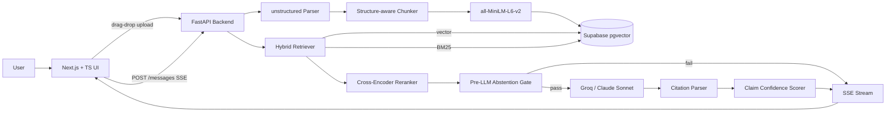

# RAG with Grounded Citations

> Production-grade document Q&A: every answer cites exact source spans, every claim carries a confidence score, and the system says "I don't know" when retrieval is weak.

**Status**: 🚧 In progress — Days 1–6 complete (full backend pipeline + working chat UI), Days 7–10 in progress.

---

## What makes this different from generic RAG

Most RAG demos retrieve chunks and dump them into an LLM prompt. This project goes further:

- **Inline citations** — every claim in the answer links back to the exact source span in the original document, not just the document name
- **Confidence scoring** — each claim is scored independently; low-confidence claims are flagged with a progress bar in the UI
- **Two-layer abstention** — pre-LLM gate (retrieval signal) + post-LLM gate (INSUFFICIENT_INFO sentinel); system refuses to hallucinate
- **Hybrid retrieval** — vector search + BM25 fused via Reciprocal Rank Fusion, then reranked with a cross-encoder
- **SSE streaming** — answers stream word-by-word; citation metadata follows in the same stream
- **Full chat UI** — dark-mode interface with drag-drop upload, document list, streaming chat, clickable citation chips, and a slide-in source panel

---

## Architecture



---

## Tech Stack

| Layer | Choice | Why |
|---|---|---|
| Frontend | Next.js 14 + TypeScript + Tailwind + shadcn/ui | Modern, type-safe |
| Backend | Python 3.12 + FastAPI + Pydantic | Best AI/ML ecosystem |
| Vector DB | pgvector on Supabase (free) | No Pinecone cost |
| Embeddings | `all-MiniLM-L6-v2` via sentence-transformers | Free, runs on CPU |
| LLM (dev) | Groq Llama 3.3 70B | Free tier, ~2s latency |
| LLM (demo) | Anthropic Claude Sonnet | Switched via `LLM_PROVIDER` env var |
| Doc parsing | `unstructured` | Production-grade PDF/MD/TXT parsing |
| Reranker | `cross-encoder/ms-marco-MiniLM-L-6-v2` | Free, runs on CPU |
| Streaming | Server-Sent Events (SSE) | Unidirectional, no WebSocket overhead |
| Hosting | Vercel (frontend) + Render (backend) | Free tier |

---

## Project Structure

```
/rag-grounded
├── transformer_architecture.txt  # Sample document for testing
├── /api                          # Python 3.12 + FastAPI backend
│   └── /app
│       ├── main.py               # FastAPI app + route wiring + CORS
│       ├── /routes
│       │   ├── documents.py      # Upload, list, status + background ingestion
│       │   ├── search.py         # Search (?mode=vector|hybrid|compare)
│       │   ├── conversations.py  # Create / list / get conversations
│       │   └── messages.py       # Ask question → full pipeline → SSE stream
│       ├── /ingestion
│       │   ├── chunker.py        # Structure-aware chunker with char offsets
│       │   └── embedder.py       # Local sentence-transformers embedder
│       ├── /retrieval
│       │   ├── vector.py         # pgvector cosine similarity search
│       │   ├── bm25.py           # Postgres tsvector full-text search
│       │   ├── reranker.py       # Cross-encoder reranker
│       │   └── hybrid.py         # RRF fusion: vector + BM25 → rerank → top-5
│       ├── /generation
│       │   ├── llm.py            # Groq + Anthropic client, swapped via env var
│       │   ├── prompt.py         # System prompt with [SOURCE_X] citation format
│       │   └── citation_parser.py # Parse [SOURCE_X] tokens → citation objects
│       ├── /verification
│       │   ├── abstention.py     # Pre-LLM gate: rerank score + keyword overlap
│       │   └── confidence.py     # Per-claim scoring via embedding cosine similarity
│       └── /db
│           └── client.py         # Supabase client
└── /web                          # Next.js 14 frontend
    ├── /app
    │   ├── layout.tsx            # Root layout, dark mode
    │   └── page.tsx              # Single-page app — sidebar + chat + source panel
    ├── /components
    │   ├── upload-zone.tsx       # Drag-drop file uploader with upload state
    │   ├── document-list.tsx     # Doc list with live status polling
    │   ├── chat-message.tsx      # Message with inline citation chips + confidence scores
    │   └── source-panel.tsx      # Slide-in panel showing cited chunk + char offsets
    └── /lib
        └── api.ts                # All backend API calls + SSE stream parser
```

---

## API Endpoints

```
POST   /v1/documents                      Upload PDF/MD/TXT → {document_id, status}
GET    /v1/documents                      List all documents
GET    /v1/documents/{id}/status          Poll ingestion status

GET    /v1/search?q=...                   Semantic search across chunks
         &top_k=5                           Number of results (default 5, max 20)
         &document_id=<uuid>               Scope to one document (optional)
         &mode=hybrid                       vector | hybrid | compare (default: hybrid)

POST   /v1/conversations                  Body: {document_id} → {conversation_id}
GET    /v1/conversations                  List all conversations
GET    /v1/conversations/{id}             Get conversation + full message history

POST   /v1/conversations/{id}/messages    Body: {question} → SSE stream
                                            event: token      {"text": "..."}
                                            event: citation   {"id", "chunk_id", "section", ...}
                                            event: complete   {"message_id", "answer", "citations",
                                                               "claim_scores", "abstained", ...}
                                            event: error      {"detail": "..."}

GET    /healthz                           Liveness check
```

---

## Key Design Decisions

### Structure-aware chunking over fixed-window chunking

Most tutorials chunk at every N tokens blindly. This project splits by markdown headings first, then by paragraph within each section. Every chunk stores `start_char` and `end_char` offsets into the original document — these are what power citation highlighting later. Blind fixed-window chunking breaks across section boundaries and makes citations meaningless.

### Local embeddings over OpenAI API

Using `all-MiniLM-L6-v2` via `sentence-transformers` instead of `text-embedding-3-small`. Reasons: zero API cost during development, no network latency, 384-dim vectors are fast to index and query. Trade-off: slightly lower retrieval quality than `text-embedding-3-small` on complex technical documents. Will benchmark both in the eval harness (Day 8).

### pgvector + SECURITY DEFINER function

Supabase's Row Level Security blocks functions from seeing rows unless the function runs with elevated permissions. The `match_chunks` Postgres function uses `SECURITY DEFINER` so it runs as its owner (postgres) and bypasses RLS. The Python client sends embeddings as text strings (`"[0.1,0.2,...]"`) rather than arrays because the Supabase client can't auto-cast Python lists to the `vector` type.

### Hybrid retrieval: vector + BM25 + RRF + cross-encoder

Vector search alone misses exact keyword matches ("backpropagation", "RLHF", proper nouns). BM25 via Postgres `tsvector` catches these for free — no extra infrastructure, no Elasticsearch. Results from both are fused with Reciprocal Rank Fusion (RRF, k=60 from Cormack et al. 2009): a chunk appearing in both lists gets a combined score even if it wasn't #1 in either. RRF requires no score normalisation across retrieval methods, making it robust without tuning.

The top-10 RRF candidates then go through a cross-encoder reranker (`cross-encoder/ms-marco-MiniLM-L-6-v2`, ~23 MB, runs on CPU). Unlike bi-encoder embeddings, the cross-encoder sees both query and passage together, giving much sharper relevance scores at the cost of being non-pre-computable. Running it only on the top-10 RRF candidates keeps latency acceptable.

### Citation injection via [SOURCE_X] tokens

The LLM is instructed via system prompt to emit `[SOURCE_X]` inline after every claim it makes. After generation, `citation_parser.py` extracts these tokens with a regex, maps each `SOURCE_X` number to the corresponding chunk's UUID and `(start_char, end_char)` span, and replaces tokens with clean `[1]`, `[2]` markers in the answer text. Hallucinated citation numbers (outside the range of provided chunks) are silently dropped and logged.

### Two-layer abstention

The system refuses to answer when retrieval is too weak via two independent gates:

**Pre-LLM gate** (`verification/abstention.py`) — fires before any LLM call, saving tokens on clearly out-of-scope questions. Uses two signals: (1) the top-1 cross-encoder rerank score as a relevance proxy (threshold: -6.0, tunable via `ABSTAIN_RERANK_THRESHOLD`), and (2) Jaccard overlap between query unigrams and chunk unigrams (threshold: 0.08, tunable via `ABSTAIN_JACCARD_THRESHOLD`). Either signal failing triggers abstention.

**Post-LLM gate** (`generation/citation_parser.py`) — catches borderline cases the retrieval signal missed. The LLM is instructed to respond with the exact sentinel string `INSUFFICIENT_INFO` when sources don't support an answer. The citation parser checks for this before any regex processing and returns `abstained: true` with a human-readable message.

Both thresholds are env-var tunable, designed to be optimised via the Day 8 eval harness ROC curve.

### Per-claim confidence scoring

After generation, `verification/confidence.py` makes one small LLM call to split the answer into atomic claims, embeds all claims in a single batch (reusing the already-loaded sentence-transformers model), then computes cosine similarity between each claim embedding and its cited chunk embeddings. The score is the max similarity across cited chunks — a claim needs at least one strongly supporting chunk to be considered confident. Claims scoring below 0.50 (tunable via `CLAIM_CONFIDENCE_THRESHOLD`) are flagged in the UI with an amber indicator and a progress bar.

The trade-off vs. NLI entailment models: cosine similarity reuses the already-loaded embedder (no new model, no extra memory), adds ~50ms for the embedding batch, and is good enough for a confidence signal. A true NLI model would be more accurate but adds ~300ms per claim and requires another model download.

### SSE streaming: two-phase approach

True token-by-token LLM streaming would require buffering the full response anyway to resolve `[SOURCE_X]` citations (you can't map a citation token to a chunk ID until you know which chunks were retrieved). Instead, the pipeline calls the LLM once (blocking, ~2s on Groq), parses the full response, then streams the answer word-by-word over SSE at ~50 words/sec. Citation metadata follows as `citation` events, then a single `complete` event with the full structured payload. This gives the UI a live typing effect while keeping citation resolution and confidence scoring clean and testable.

### Frontend: single-page three-column layout

Sidebar (upload + document list) / chat / source panel. The source panel animates in and out via a `w-0` → `w-80` CSS transition when a citation chip is clicked — no routing needed. The document list polls `GET /v1/documents/{id}/status` every 2s for any document in `processing` or `pending` state, stopping automatically once all documents reach a terminal state. The SSE stream is parsed entirely client-side in `lib/api.ts` with no SSE library — raw `fetch` + `ReadableStream` reader, splitting on `\n\n` boundaries.

---

## Setup

### Prerequisites

- Python 3.12+ and `uv`
- Node.js 18+ and `pnpm`
- A free [Supabase](https://supabase.com) account
- A free [Groq](https://console.groq.com) account

### 1. Database setup

In the Supabase SQL Editor, run the full schema:

```sql
CREATE EXTENSION IF NOT EXISTS vector;

CREATE TABLE documents (
  id            UUID PRIMARY KEY DEFAULT gen_random_uuid(),
  title         TEXT NOT NULL,
  source_type   TEXT NOT NULL,
  status        TEXT DEFAULT 'pending',
  error_message TEXT,
  created_at    TIMESTAMPTZ DEFAULT now()
);

CREATE TABLE chunks (
  id            UUID PRIMARY KEY DEFAULT gen_random_uuid(),
  document_id   UUID REFERENCES documents(id) ON DELETE CASCADE,
  chunk_index   INTEGER NOT NULL,
  content       TEXT NOT NULL,
  start_char    INTEGER NOT NULL,
  end_char      INTEGER NOT NULL,
  section_title TEXT,
  embedding     vector(384),
  ts_vector     tsvector GENERATED ALWAYS AS (to_tsvector('english', content)) STORED
);

CREATE INDEX chunks_embedding_idx ON chunks USING ivfflat (embedding vector_cosine_ops) WITH (lists = 100);
CREATE INDEX chunks_ts_idx ON chunks USING gin(ts_vector);

CREATE TABLE conversations (
  id          UUID PRIMARY KEY DEFAULT gen_random_uuid(),
  document_id UUID REFERENCES documents(id) ON DELETE CASCADE,
  title       TEXT,
  created_at  TIMESTAMPTZ DEFAULT now()
);

CREATE TABLE messages (
  id              UUID PRIMARY KEY DEFAULT gen_random_uuid(),
  conversation_id UUID REFERENCES conversations(id) ON DELETE CASCADE,
  role            TEXT NOT NULL,
  content         TEXT NOT NULL,
  citations       JSONB,
  claim_scores    JSONB,
  abstained       BOOLEAN DEFAULT false,
  retrieval_meta  JSONB,
  created_at      TIMESTAMPTZ DEFAULT now()
);

CREATE INDEX messages_conversation_idx ON messages (conversation_id, created_at);
```

Then create the two RPC functions:

```sql
-- Vector similarity search
CREATE FUNCTION match_chunks(
  query_embedding text, match_count int, filter_document_id uuid DEFAULT NULL
)
RETURNS TABLE (id uuid, document_id uuid, content text, section_title text, start_char int, end_char int, similarity float)
LANGUAGE sql STABLE SECURITY DEFINER SET search_path = public AS $$
  SELECT c.id, c.document_id, c.content, c.section_title, c.start_char, c.end_char,
         1 - (c.embedding <=> query_embedding::vector(384)) AS similarity
  FROM chunks c
  WHERE c.embedding IS NOT NULL
    AND (filter_document_id IS NULL OR c.document_id = filter_document_id)
  ORDER BY c.embedding <=> query_embedding::vector(384) ASC
  LIMIT match_count;
$$;

-- BM25 full-text search
CREATE FUNCTION bm25_search(
  query_text text, match_count int, filter_document_id uuid DEFAULT NULL
)
RETURNS TABLE (id uuid, document_id uuid, content text, section_title text, start_char int, end_char int, rank float)
LANGUAGE sql STABLE SECURITY DEFINER SET search_path = public AS $$
  SELECT c.id, c.document_id, c.content, c.section_title, c.start_char, c.end_char,
         ts_rank_cd(c.ts_vector, plainto_tsquery('english', query_text))::float AS rank
  FROM chunks c
  WHERE c.ts_vector @@ plainto_tsquery('english', query_text)
    AND (filter_document_id IS NULL OR c.document_id = filter_document_id)
  ORDER BY rank DESC LIMIT match_count;
$$;
```

### 2. Backend

```bash
cd api
cp .env.example .env
```

Fill in `api/.env`:

```
SUPABASE_URL=https://your-project.supabase.co
SUPABASE_SERVICE_KEY=your-service-role-key

GROQ_API_KEY=gsk_...          # free at console.groq.com
ANTHROPIC_API_KEY=sk-ant-...  # for final demo only
LLM_PROVIDER=groq             # groq | anthropic

# Abstention thresholds (optional — defaults shown)
ABSTAIN_RERANK_THRESHOLD=-6.0
ABSTAIN_JACCARD_THRESHOLD=0.08
CLAIM_CONFIDENCE_THRESHOLD=0.50
```

```bash
uv sync
uv run uvicorn app.main:app --reload --port 8000
```

### 3. Frontend

```bash
cd web
# .env.local already set to http://localhost:8000
pnpm install
pnpm dev
```

Open `http://localhost:3000`.

### 4. Try it

Upload `transformer_architecture.txt` from the project root. Once the status dot turns green, click the document and try:

```
How does scaled dot-product attention work?
What is the quadratic complexity problem with self-attention?
How does multi-head attention differ from single-head attention?
What are the limitations of Transformer models?
What is RLHF?
What is the capital of France?    ← triggers abstention
```

---

## Eval Results

*(Day 8 — to be filled in after eval harness is built)*

| Metric | Vector-only | Hybrid | Hybrid + Rerank |
|---|---|---|---|
| Recall@5 | — | — | — |
| Answer accuracy | — | — | — |
| Citation precision | — | — | — |

---

## Roadmap

- [x] Day 1 — Scaffolding, PDF/MD ingestion, document storage
- [x] Day 2 — Structure-aware chunking, local embeddings, vector search
- [x] Day 3 — BM25 keyword search + hybrid RRF fusion + cross-encoder reranking
- [x] Day 4 — LLM answer generation with inline citation injection and SSE streaming
- [x] Day 5 — Two-layer abstention + per-claim confidence scoring
- [x] Day 6 — Full chat UI: drag-drop upload, streaming, citation chips, source panel, confidence badges
- [ ] Day 7 — Auth (Supabase), multi-tenancy, deployment to Vercel + Render
- [ ] Day 8 — Evaluation harness (20 Q&A ground truth set, recall@5, citation precision)
- [ ] Day 9 — OpenTelemetry tracing, Prometheus metrics, Grafana dashboard
- [ ] Day 10 — DESIGN.md, 90-sec Loom demo video, final polish

---

## Cost

| Component | Service | Cost |
|---|---|---|
| Embeddings | Local `all-MiniLM-L6-v2` | $0 |
| Reranker | Local `ms-marco-MiniLM-L-6-v2` | $0 |
| LLM (dev) | Groq Cloud | $0 |
| LLM (final demo) | Anthropic Claude Sonnet | ~$5 |
| Database | Supabase free tier | $0 |
| Hosting | Vercel + Render free tier | $0 |
| **Total** | | **~$5** |
