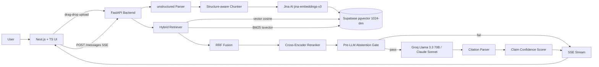

# RAG with Grounded Citations

> Production-grade document Q&A: every answer cites exact source spans, every claim carries a confidence score, and the system says "I don't know" when retrieval is weak.

[Live demo](https://rag-rounded.vercel.app) · [Architecture](#architecture) · [Eval results](#eval-results) · [Design decisions](#key-design-decisions)

---

## What makes this different from generic RAG

Most RAG demos retrieve chunks and dump them into an LLM prompt. This project goes further:

- **Inline citations** — every claim links back to the exact source span in the original document, not just the document name
- **Confidence scoring** — each claim is scored independently; low-confidence claims are flagged in the UI
- **Two-layer abstention** — pre-LLM gate (retrieval signal) + post-LLM gate (INSUFFICIENT_INFO sentinel); system refuses to hallucinate
- **Hybrid retrieval** — vector search + BM25 fused via Reciprocal Rank Fusion, then reranked with a cross-encoder
- **SSE streaming** — answers stream word-by-word; citation metadata follows in the same stream
- **Full chat UI** — dark-mode interface with drag-drop upload, document list, streaming chat, clickable citation chips, and a slide-in source panel
- **Observability** — Prometheus metrics (`/metrics`) + OpenTelemetry tracing + readiness probe (`/readyz`)

---

## Eval Results

Evaluated on a 20-question ground-truth set covering 6 distributed systems topics (consistency models, replication, consensus algorithms, distributed transactions, storage engines, observability). Each question has a verified ground-truth answer and an expected source section.

| Metric | Vector-only | Hybrid |
|---|---|---|
| Recall@5 | 1.000 | 1.000 |
| Answer accuracy (LLM-as-judge) | — | 0.925 |
| Citation precision | — | 1.000 |
| Abstention rate | — | 0.0% |

**Recall@5**: fraction of questions where the correct source section appeared in the top-5 retrieved chunks.
**Answer accuracy**: Groq Llama 3.3 70B used as judge, scoring each generated answer 0 / 0.5 / 1 against ground truth.
**Citation precision**: fraction of cited chunks whose section matched the expected source section.

Live results endpoint: `GET /v1/eval/results`

---

## Architecture



---

## Tech Stack

| Layer | Choice | Why |
|---|---|---|
| Frontend | Next.js 14 + TypeScript + Tailwind + shadcn/ui | Modern, type-safe |
| Backend | Python 3.13 + FastAPI + Pydantic | Best AI/ML ecosystem |
| Vector DB | pgvector on Supabase (free) | No Pinecone cost |
| Embeddings | Jina AI `jina-embeddings-v3` (1024-dim, free API) | Zero RAM on server, 1M tokens free |
| LLM (dev) | Groq Llama 3.3 70B | Free tier, ~2s latency |
| LLM (demo) | Anthropic Claude Sonnet | Switched via `LLM_PROVIDER` env var |
| Doc parsing | `unstructured` | Production-grade PDF/MD/TXT parsing |
| Reranker | `cross-encoder/ms-marco-MiniLM-L-6-v2` | Free, runs on CPU |
| Streaming | Server-Sent Events (SSE) | Unidirectional, no WebSocket overhead |
| Metrics | Prometheus (`prometheus-client`) + `GET /metrics` | RED method per pipeline stage |
| Tracing | OpenTelemetry SDK (console exporter, OTLP-ready) | Vendor-neutral, Jaeger/Grafana compatible |
| Hosting | Vercel (frontend) + Render (backend, Docker) | Free tier |

---

## Project Structure

```
/rag-grounded
├── distributed_systems_rag_eval.md   # Eval document (6 sections, 20 Q&A pairs)
├── /api                              # Python 3.13 + FastAPI backend
│   ├── Dockerfile
│   └── /app
│       ├── main.py                   # FastAPI app, CORS, /metrics, /readyz, /healthz
│       ├── /routes
│       │   ├── documents.py          # Upload, list, status + background ingestion
│       │   ├── search.py             # Search (?mode=vector|hybrid|compare)
│       │   ├── conversations.py      # Create / list / get conversations
│       │   ├── messages.py           # Ask question → full pipeline → SSE stream
│       │   └── eval.py               # GET /v1/eval/results
│       ├── /ingestion
│       │   ├── chunker.py            # Structure-aware chunker with char offsets
│       │   └── embedder.py           # Jina AI API embedder (1024-dim)
│       ├── /retrieval
│       │   ├── vector.py             # pgvector cosine similarity search
│       │   ├── bm25.py               # Postgres tsvector full-text search
│       │   ├── reranker.py           # Cross-encoder reranker
│       │   └── hybrid.py             # RRF fusion: vector + BM25 → rerank → top-5
│       ├── /generation
│       │   ├── llm.py                # Groq + Anthropic client, swapped via env var
│       │   ├── prompt.py             # System prompt with [SOURCE_X] citation format
│       │   └── citation_parser.py    # Parse [SOURCE_X] tokens → citation objects
│       ├── /verification
│       │   ├── abstention.py         # Pre-LLM gate: rerank score + keyword overlap
│       │   └── confidence.py         # Per-claim scoring via embedding cosine similarity
│       ├── /telemetry
│       │   ├── otel.py               # OpenTelemetry setup (console / OTLP)
│       │   └── metrics.py            # Prometheus counters + histograms (RED method)
│       └── /db
│           └── client.py             # Supabase client
├── /tests
│   └── /eval
│       ├── eval_set.json             # 20 ground-truth Q&A pairs
│       ├── run_eval.py               # Eval harness script
│       └── results.json              # Latest eval run output
└── /web                              # Next.js 14 frontend
    └── /app
        ├── page.tsx                  # Single-page app — sidebar + chat + source panel
        ├── /components
        │   ├── upload-zone.tsx
        │   ├── document-list.tsx
        │   ├── chat-message.tsx      # Inline citation chips + confidence badges
        │   └── source-panel.tsx      # Slide-in panel with cited chunk text
        └── /lib
            └── api.ts                # All API calls + SSE stream parser
```

---

## API Endpoints

```
POST   /v1/documents                      Upload PDF/MD/TXT → {document_id, status}
GET    /v1/documents                      List all documents
GET    /v1/documents/{id}/status          Poll ingestion status

GET    /v1/search?q=...                   Semantic search
         &top_k=5
         &document_id=<uuid>
         &mode=vector|hybrid|compare

POST   /v1/conversations                  {document_id} → {conversation_id}
GET    /v1/conversations
GET    /v1/conversations/{id}

POST   /v1/conversations/{id}/messages    {question} → SSE stream
                                            event: token      {"text": "..."}
                                            event: citation   {"id", "chunk_id", "section", ...}
                                            event: complete   {"message_id", "answer", "citations",
                                                               "claim_scores", "abstained", ...}
                                            event: error      {"detail": "..."}

GET    /v1/eval/results                   Latest eval harness results (JSON)

GET    /metrics                           Prometheus scrape endpoint
GET    /healthz                           Liveness probe
GET    /readyz                            Readiness probe (checks Supabase + Jina)
```

---

## Key Design Decisions

### Structure-aware chunking over fixed-window chunking

Most tutorials chunk at every N tokens blindly. This project splits by markdown headings first, then by paragraph within each section. Every chunk stores `start_char` and `end_char` offsets into the original document — these power citation highlighting. Blind fixed-window chunking breaks across section boundaries and makes citations meaningless.

### Jina AI embeddings (cloud API, zero server RAM)

Originally used `all-MiniLM-L6-v2` via `sentence-transformers` locally. Switching to deployment on Render's free tier (512 MB RAM) caused OOM on first request — sentence-transformers loads ~300 MB into RAM. Solution: Jina AI's `jina-embeddings-v3` API (1024-dim, 1M tokens free on signup). Zero RAM, simple HTTP call, supports asymmetric retrieval (`task: "retrieval.passage"` for ingestion, `task: "retrieval.query"` for search). The task type distinction meaningfully improves retrieval quality for question → passage matching.

### pgvector + SECURITY DEFINER function

Supabase's Row Level Security blocks Postgres functions from seeing rows unless the function runs with elevated permissions. The `match_chunks` function uses `SECURITY DEFINER` so it runs as postgres and bypasses RLS. The Python client sends embeddings as text strings (`"[0.1,0.2,...]"`) because the Supabase client can't auto-cast Python lists to the `vector` type.

### Hybrid retrieval: vector + BM25 + RRF + cross-encoder

Vector search alone misses exact keyword matches (proper nouns, technical terms). BM25 via Postgres `tsvector` catches these for free — no Elasticsearch. Results are fused with Reciprocal Rank Fusion (RRF, k=60): a chunk appearing in both lists gets a combined score even if it wasn't #1 in either. RRF requires no score normalisation, making it robust without tuning. Top-10 RRF candidates go through a cross-encoder reranker — unlike bi-encoder embeddings, the cross-encoder sees query and passage together, giving sharper relevance scores. Running it only on top-10 keeps latency acceptable.

### Two-layer abstention

**Pre-LLM gate** (`abstention.py`) — fires before any LLM call, saving tokens. Two signals: (1) top-1 cross-encoder rerank score (threshold: `-8.0`, env-tunable via `ABSTAIN_RERANK_THRESHOLD`), and (2) Jaccard overlap between query unigrams and chunk unigrams (threshold: `0.0`, effectively disabled — Jaccard is too aggressive for meta-queries like "summarise"). Either signal failing triggers abstention.

**Post-LLM gate** (`citation_parser.py`) — the LLM is instructed to respond with `INSUFFICIENT_INFO` when sources don't support the answer. The parser checks for this sentinel before regex processing and returns `abstained: true`.

Both thresholds are env-var tunable. Setting `ABSTAIN_JACCARD_THRESHOLD=0.0` was the fix for prod abstaining on valid summarisation queries — Jaccard overlap is near zero for meta-instructions like "summarise the key points" even when retrieval is strong.

### Citation injection via [SOURCE_X] tokens

The LLM emits `[SOURCE_X]` inline after every claim. After generation, `citation_parser.py` maps each token to the corresponding chunk's UUID and `(start_char, end_char)` span, and replaces tokens with clean `[1]`, `[2]` markers. Hallucinated citation numbers (outside the range of provided chunks) are silently dropped and logged.

### Per-claim confidence scoring

`confidence.py` makes one small LLM call to split the answer into atomic claims, embeds all claims in a single Jina API batch, then computes cosine similarity between each claim embedding and its cited chunk embeddings. Score = max similarity across cited chunks. Claims below `CLAIM_CONFIDENCE_THRESHOLD` (default 0.50) are flagged with an amber indicator in the UI. Trade-off vs. NLI entailment: cosine reuses the already-integrated embedder (no extra model download), adds ~50ms, and is sufficient for a UI confidence signal.

### Prometheus metrics (RED method)

`/metrics` exposes per-stage RED metrics: `rag_requests_total`, `rag_request_duration_seconds`, `rag_retrieval_duration_seconds{mode}`, `rag_embedding_duration_seconds{purpose}`, `rag_llm_duration_seconds{provider,purpose}`, `rag_abstentions_total{reason}`. These are scrape-ready for Grafana Cloud (free tier, no Docker required) or any Prometheus-compatible backend.

---

## Setup

### Prerequisites

- Python 3.13+ and `uv`
- Node.js 22+ and `pnpm`
- Free [Supabase](https://supabase.com) account
- Free [Groq](https://console.groq.com) account
- Free [Jina AI](https://jina.ai) account (1M tokens free)

### 1. Database setup

In the Supabase SQL Editor:

```sql
CREATE EXTENSION IF NOT EXISTS vector;

CREATE TABLE documents (
  id UUID PRIMARY KEY DEFAULT gen_random_uuid(),
  title TEXT NOT NULL, source_type TEXT NOT NULL,
  status TEXT DEFAULT 'pending', error_message TEXT,
  created_at TIMESTAMPTZ DEFAULT now()
);

CREATE TABLE chunks (
  id UUID PRIMARY KEY DEFAULT gen_random_uuid(),
  document_id UUID REFERENCES documents(id) ON DELETE CASCADE,
  chunk_index INTEGER NOT NULL, content TEXT NOT NULL,
  start_char INTEGER NOT NULL, end_char INTEGER NOT NULL,
  section_title TEXT, embedding vector(1024),
  ts_vector tsvector GENERATED ALWAYS AS (to_tsvector('english', content)) STORED
);

CREATE INDEX chunks_embedding_idx ON chunks USING ivfflat (embedding vector_cosine_ops) WITH (lists = 100);
CREATE INDEX chunks_ts_idx ON chunks USING gin(ts_vector);

CREATE TABLE conversations (
  id UUID PRIMARY KEY DEFAULT gen_random_uuid(),
  document_id UUID REFERENCES documents(id) ON DELETE CASCADE,
  title TEXT, created_at TIMESTAMPTZ DEFAULT now()
);

CREATE TABLE messages (
  id UUID PRIMARY KEY DEFAULT gen_random_uuid(),
  conversation_id UUID REFERENCES conversations(id) ON DELETE CASCADE,
  role TEXT NOT NULL, content TEXT NOT NULL,
  citations JSONB, claim_scores JSONB,
  abstained BOOLEAN DEFAULT false, retrieval_meta JSONB,
  created_at TIMESTAMPTZ DEFAULT now()
);
```

Then create the two RPC functions — see `api/app/db/` for the full SQL.

### 2. Backend

```bash
cd api
cp .env.example .env   # fill in keys
uv sync
uv run uvicorn app.main:app --reload --port 8000

# Verify
curl http://localhost:8000/healthz
curl http://localhost:8000/readyz
curl http://localhost:8000/metrics | head -20
```

### 3. Frontend

```bash
cd web
pnpm install
pnpm dev   # http://localhost:3000
```

### 4. Run the eval harness

```bash
# Upload distributed_systems_rag_eval.md via the UI, get document_id, then:
cd api
uv run python tests/eval/run_eval.py \
  --document-id <uuid> \
  --output tests/eval/results.json
```

---

## Roadmap

- [x] Day 1 — Scaffolding, PDF/MD ingestion, document storage
- [x] Day 2 — Structure-aware chunking, Jina embeddings, vector search
- [x] Day 3 — BM25 keyword search + hybrid RRF fusion + cross-encoder reranking
- [x] Day 4 — LLM answer generation with inline citation injection and SSE streaming
- [x] Day 5 — Two-layer abstention + per-claim confidence scoring
- [x] Day 6 — Full chat UI: drag-drop upload, streaming, citation chips, source panel
- [x] Day 7 — Dockerfiles, CI pipeline, deployment to Vercel + Render
- [x] Day 8 — Evaluation harness (20 Q&A ground truth, recall@5, answer accuracy, citation precision)
- [x] Day 9 — Prometheus metrics (`/metrics`), OpenTelemetry tracing, `/readyz` readiness probe
- [ ] Day 10 — DESIGN.md, 90-sec Loom demo video, final polish

---

## Cost

| Component | Service | Cost |
|---|---|---|
| Embeddings | Jina AI free tier (1M tokens) | $0 |
| Reranker | Local `ms-marco-MiniLM-L-6-v2` | $0 |
| LLM (dev) | Groq Cloud | $0 |
| LLM (final demo) | Anthropic Claude Sonnet | ~$5 |
| Database | Supabase free tier | $0 |
| Hosting | Vercel + Render free tier | $0 |
| **Total** | | **~$5** |
